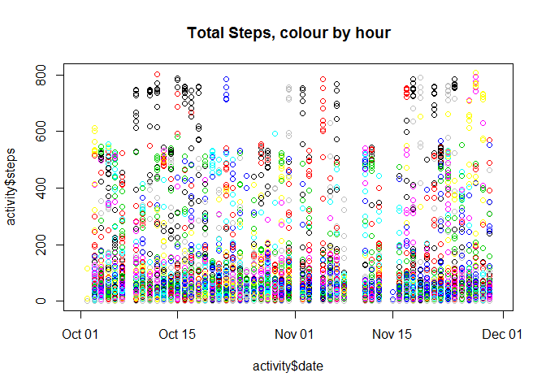

# Reproducible Research: Peer Assessment 1
Daryl Hegyi  
Sunday, February 15, 2015  
### Project Location

* [GitHub Repository](https://github.com/dar7yl/ReproducibleResearch)

---
### Project Instructions
* [Project Instructions on website](https://class.coursera.org/repdata-011/human_grading/view/courses/973512/assessments/3/submissions)
* [local Copy](RepData_PeerAssessment1/doc/instructions.pdf)

### Set up R environment


## Loading and preprocessing the data
The data is from a personal activity monitoring device that collects data at 5 minute intervals through out the day. The data consists of two months of data from an anonymous individual collected during the months of October and November, 2012 and include the number of steps taken in 5 minute intervals each day.

* The data for this assignment can be downloaded from the course web site:
		[Activity monitoring data ](https://d396qusza40orc.cloudfront.net/repdata%2Fdata%2Factivity.zip) - 52K
		
### Load Data function, called later

```r
load_data <- function()
{
	library(downloader)

	csvfile<-file.path("data", "activity.csv")
	if (!file.exists(csvfile))
	{
		zipfile <- file.path("RepData_PeerAssessment1", "activity.zip")
		if (!file.exists(zipfile))
		{
			#we're going to download it to a different location
			zipfile <- file.path("data", "activity.zip")
			fileurl <- "https://d396qusza40orc.cloudfront.net/repdata%2Fdata%2Factivity.zip"
			
			print(paste("Downloading files from '",fileurl,"' to '",zipfile,"'",sep="") )
			
			download.file(fileurl, zipfile, quiet = FALSE, mode = "wb", cacheOK = TRUE )
		}
	
		print(paste("Unzipping ", zipfile, "to data/",sep=" "))
		unzip(zipfile, junkpaths=TRUE, exdir="data", unzip="internal", setTimes=FALSE)
		print(paste("data is now in ", csvfile),sep="")
	}
	
	#we'll go right ahead and read the data and put it in the global environment
	activity_Classes <- c( "numeric", "Date", "numeric")
	activity <- read.csv(csvfile, colClasses= activity_Classes)
	assign("activity", activity, envir = .GlobalEnv,) 
}
```

### Read in and massage data

```r
load_data()  #get data into activity

#extract days of week
activity$dow<-factor( as.POSIXlt(activity$date)$wday, levels=c(0,1,2,3,4,5,6), 
				 labels=c("Sun","Mon","Tue","Wed","Thu","Fri","Sat"), ordered=TRUE)

#extract hour from interval
activity$interval.hour<-as.factor(floor(activity$interval/100))

summary(activity)
```

```
##      steps             date               interval       dow      
##  Min.   :  0.00   Min.   :2012-10-01   Min.   :   0.0   Sun:2304  
##  1st Qu.:  0.00   1st Qu.:2012-10-16   1st Qu.: 588.8   Mon:2592  
##  Median :  0.00   Median :2012-10-31   Median :1177.5   Tue:2592  
##  Mean   : 37.38   Mean   :2012-10-31   Mean   :1177.5   Wed:2592  
##  3rd Qu.: 12.00   3rd Qu.:2012-11-15   3rd Qu.:1766.2   Thu:2592  
##  Max.   :806.00   Max.   :2012-11-30   Max.   :2355.0   Fri:2592  
##  NA's   :2304                                           Sat:2304  
##  interval.hour  
##  0      :  732  
##  1      :  732  
##  2      :  732  
##  3      :  732  
##  4      :  732  
##  5      :  732  
##  (Other):13176
```

```r
plot(activity$date, activity$steps, col=as.factor(activity$date), 
	  main="Total Steps, colour by date")
```

 

```r
plot(activity$date, activity$steps, col=activity$interval.hour, 
	  main="Total Steps, colour by hour")
```

 


## What is mean total number of steps taken per day?

```r
total_steps<-tapply(activity$steps, as.factor(activity$date), sum)

summary(total_steps)
```

```
##    Min. 1st Qu.  Median    Mean 3rd Qu.    Max.    NA's 
##      41    8841   10760   10770   13290   21190       8
```

```r
mean(total_steps, na.rm=TRUE)
```

```
## [1] 10766.19
```

```r
plot(total_steps, type="b", main="Total Steps per day")
```

 

```r
hist(total_steps)
```

 


## What is the average daily activity pattern?

```r
plot(activity$interval.hour, activity$steps, col="orange")
```

 

```r
means_by.date<-aggregate( activity$steps, 
								  by=list(as.factor(activity$date)), 
									FUN="mean", na.rm=T)
summary(means_by.date)
```

```
##        Group.1         x          
##  2012-10-01: 1   Min.   : 0.1424  
##  2012-10-02: 1   1st Qu.:30.6979  
##  2012-10-03: 1   Median :37.3785  
##  2012-10-04: 1   Mean   :37.3826  
##  2012-10-05: 1   3rd Qu.:46.1597  
##  2012-10-06: 1   Max.   :73.5903  
##  (Other)   :55   NA's   :8
```

```r
tmean<-mean(means_by.date$x, na.rm=TRUE)
tmean
```

```
## [1] 37.3826
```

```r
plot(means_by.date, main="Mean by Date", na.action=na.omit)
```

 


## Imputing missing values

```r
steps.na<-is.na(activity$steps)
summary(steps.na)

activity$steps[steps.na)] =0
plot(activity$steps, col=steps.na+1)

total_steps<-tapply(activity$steps, activity$date, sum)
summary(total_steps)

mean_steps<-tapply(activity$steps, activity$date, FUN=function(x){mean(x,na.rm=T)})
summary(mean_steps)

dt<-as.Date(names(mean_steps))

mean.na<-is.na(mean_steps)
summary(mean.na)
mean.na[!mean.na]=NA  # ignore non-na's

plot(dt, mean_steps, col="green")
points(dt, mean.na*30, col="red")
```


## Are there differences in activity patterns between weekdays and weekends?

```r
plot(activity$steps, col=as.factor(activity$date))
```

 

```r
col1=as.factor(activity$interval/24);

plot(activity$dow, activity$steps, main="Steps by Day of Week", 
	  col=as.factor(activity$interval.hour))
```

 

```r
#steps.by_dow<-split(activity, activity$dow)
#lapply(steps.by_dow, function(x){plot(x$Interval)})
```
